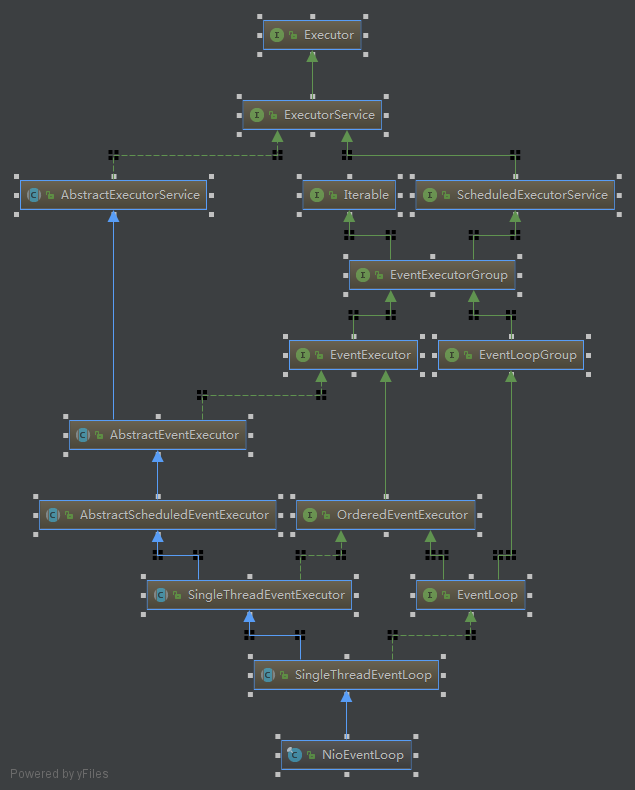

## NioEventLoop再次学习
昨天开始学习了NioEventLoop，今天详细看了NioEventLoop的底层实现。

NioEventLoop的继承关系如图所示：  
   
从图中可以看出来，NioEventLoop的终极父类是Executor，也就是是说NioEventLoop是一个线程池（但是它也可以看做一个线程）。在程序中并没有使用NioEventLoop，而是通过使用NioEventLoopGroup对象来最终使用NioEventLoop的。

### 1 NioEventLoopGroup
NioEventLoopGroup是一个线程池，从上面的类继承关系可以看出来，NioEventLoopGroup的终极父类也是Executor，因为EventLoopGroup是它的父类。NioEventLoopGroup作为一个线程池，里面盛放的对象就是NioEventLoop对象。也就是说NioEventLoopGroup中盛放的时一个一个的线程池NioEventLoop。下面看看NioEventLoopGroup底层实现。

通过`new NioEventLoopGroup()`会调用NioEventLoopGroup的构造器，在一步一步，最终调用NioEventLoopGroup的父类的构造器，这里说一点，既然NioEventLoopGroup是一个线程池，那么就会指定线程池中的线程数，如果直接`new NioEventLoopGroup()`那么会开启默认个线程，默认数是CPU内核的2倍。
```
会调用父类MultithreadEventLoopGroup的构造器，这里会指定NioEventLoopGroup池中的线程数
protected MultithreadEventLoopGroup(int nThreads, ThreadFactory threadFactory, Object... args) {
    super(nThreads == 0 ? DEFAULT_EVENT_LOOP_THREADS : nThreads, threadFactory, args);
}

//调用父类MultithreadEventExecutorGroup的构造器
protected MultithreadEventExecutorGroup(int nThreads, ThreadFactory threadFactory, Object... args) {
   
    //线程工厂，一定是用来创建线程的
    threadFactory = this.newDefaultThreadFactory();

    //这里会发现NioEventLoopGroup中实际上存放的就是EventExecutor，把它看做线程
    //以数组的形式保存
    this.children = new SingleThreadEventExecutor[nThreads];

    //实例化每个数组元素，也就是创建每一个EventExecutor对象
    this.children[i] = this.newChild(threadFactory, args);
             
    //一旦数组中有EventExecutor创建不成功，那么本次创建失败
    //已经创建的EventExecutor对象就要被销毁
    this.children[j].shutdownGracefully();
}
```
这里需要看看newChild()方法：
```
//可以发现这里会交由其子类来重写
protected abstract EventExecutor newChild(ThreadFactory var1, Object... var2) throws Exception;
```
因为关注的是NioEventLoopGroup，因此看看它对该方法的重写：
```
protected EventExecutor newChild(ThreadFactory threadFactory, Object... args) throws Exception {
    return new NioEventLoop(this, threadFactory, (SelectorProvider)args[0], ((SelectStrategyFactory)args[1]).newSelectStrategy(), (RejectedExecutionHandler)args[2]);
}
```
从这个方法可以看出，创建的EventExecutor实际上就是NioEventLoop对象。

从这里就可以看出，虽然程序中没有直接操作NioEventLoop，但是通过NioEventLoopGroup，就可以使用NioEventLoop。

### 2 NioEventLoop
直接看上面调用的NioEventLoop的构造方法：
```
 NioEventLoop(NioEventLoopGroup parent, ThreadFactory threadFactory, SelectorProvider selectorProvider, SelectStrategy strategy, RejectedExecutionHandler rejectedExecutionHandler) {
 	//首先调用父类构造器
    super(parent, threadFactory, false, DEFAULT_MAX_PENDING_TASKS, rejectedExecutionHandler);

    if (selectorProvider == null) {
        throw new NullPointerException("selectorProvider");
    } else if (strategy == null) {
        throw new NullPointerException("selectStrategy");
    } else {
        this.provider = selectorProvider;
        //这个和获得Selector对象的方法很像，估计就是
        NioEventLoop.SelectorTuple selectorTuple = this.openSelector();
        this.selector = selectorTuple.selector;
        this.unwrappedSelector = selectorTuple.unwrappedSelector;
        this.selectStrategy = strategy;
    }
}
```

然后调用了NioEventLoop的父类构造器：
```
//继续调用父类构造器
protected SingleThreadEventLoop(EventLoopGroup parent, ThreadFactory threadFactory, boolean addTaskWakesUp, int maxPendingTasks, RejectedExecutionHandler rejectedExecutionHandler) {
    super(parent, threadFactory, addTaskWakesUp, maxPendingTasks, rejectedExecutionHandler);
}

//调用SingleThreadEventExecutor构造器
protected SingleThreadEventExecutor(EventExecutorGroup parent, ThreadFactory threadFactory, boolean addTaskWakesUp, int maxPendingTasks, RejectedExecutionHandler rejectedHandler) {

	//创建SingleThreadEventExecutor线程池中的线程
	this.thread = threadFactory.newThread(new Runnable() {
    	public void run() {
    		调用run方法
        	SingleThreadEventExecutor.this.run();
        }
    }
                      
}

//由子类重写
protected abstract void run();
```
解释：SingleThreadEventExecutor是一个线程池，因此需要制定里面的线程，从名字可以看出来，SingleThreadEventExecutor线程池中只有一个线程，也就是它的thread属性。SingleThreadEventExecutor的子类NioEventLoop又重写了run()方法，因此在SingleThreadEventExecutor线程池中的线程执行的时候回调用NioEventLoop的run()方法。然后把创建的NioEventLoop对象赋值给MultithreadEventExecutorGroup中的children[i].

至此可以明白了，创建NioEventLoopGroup时，实际上就创建了若干个NioEventLoop线程池对象，并将其放入到NioEventLoopGroup中，交由其统一管理。

又因为NioEventLoop现场池中只有一个线程，因此，可以把NioEventLoop看做一个线程。NioEventLoop负责的事情就是连接和IO操作。具体就是在NioEventLoop的run方法中实现的。

### 3 NioEventLoop的职责
创建完NioEventLoopGroup之后，实际上就创建了NioEventLoop，然后将NioEventLoopGroup绑定到启动类上Bootstrap，服务器端是绑定到ServerBootstrap启动类上。
```
//绑定
bootstrap.group(group,worker);

//启动，监控,在这里会启动NioEventLoop中的线程，监听，或者处理IO
bootstrap.bind()
		//同步等待
		.sync();
```

看看bind()方法，然后进行一系列的调用：
```
public ChannelFuture bind() {    
    return this.doBind(localAddress);
}

//doBind
private ChannelFuture doBind(final SocketAddress localAddress) {
    AbstractBootstrap.doBind0(regFuture, channel, localAddress, promise);
}

//doBind0
private static void doBind0(final ChannelFuture regFuture, final Channel channel, final SocketAddress localAddress, final ChannelPromise promise) {
	/**
	*这里会执行eventLoop().execute(),往线程池中提交任务
	*eventLoop()会返回NioEventLoop对象
	*那么就会执行NioEventLoop的execute()方法
	*/
    channel.eventLoop().execute(new Runnable() {
        public void run() {
            if (regFuture.isSuccess()) {
                channel.bind(localAddress, promise).addListener(ChannelFutureListener.CLOSE_ON_FAILURE);
            } else {
                promise.setFailure(regFuture.cause());
            }

        }
    });
}

//NioEventLoop从SingleThreadEventExecutor继承过来的execute()
public void execute(Runnable task) {
    //这里启动NioEventLoop中的线程
    this.startThread();
}
```

然后将会执行run()方法，NioEventLoop的重写的run方法也会被执行：
```
//NioEventLoop重写的run
 protected void run() {
    while(true) {
        while(true) {
            
            //实际调用select方法阻塞，等待IO或者网络连接
            this.select(this.wakenUp.getAndSet(false));
      
            //处理相关事件   
            this.processSelectedKeys();
                       
        }
    }
}
```
下面就是经过一系列调用执行的方法：
```
private void processSelectedKeysPlain(Set<SelectionKey> selectedKeys) {
	//这就和利用原生java NIO jdk编程非常像了，获得channel上发生动作的集合，遍历这个集合，
	//不停的处理这些channel上的动作
    if (!selectedKeys.isEmpty()) {
        Iterator i = selectedKeys.iterator();

        while(true) {
            SelectionKey k = (SelectionKey)i.next();
            Object a = k.attachment();
            i.remove();
            if (a instanceof AbstractNioChannel) {
                this.processSelectedKey(k, (AbstractNioChannel)a);
            } else {
                NioTask<SelectableChannel> task = (NioTask)a;
                processSelectedKey(k, task);
            }

            if (!i.hasNext()) {
                break;
            }

            if (this.needsToSelectAgain) {
                this.selectAgain();
                selectedKeys = this.selector.selectedKeys();
                if (selectedKeys.isEmpty()) {
                    break;
                }

                i = selectedKeys.iterator();
            }
        }

    }
}
```

ok，至此完毕。可算是NioEventLoop搞懂了。

### 4 总结
在程序编写的时候不需要直接操作NioEventLoop，而是通过NioEventLoopGroup来，间接创建NioEventLoop。NioEventLoopGroup是一个线程池，里面存放若干个NioEventLoop对象。    

NioEventLoop是一个线程池对象，但是它里面只有一个线程，因此也可以将其看做一个线程，它主要做的事情就是，开启它里面的唯一的那个线程，如果是负责监听连接的话，那么将ServerSocketChannel注册在这个线程上，并声明对Accept感兴趣，这个线程就会通过Selector调用select()阻塞，直至有连接请求过来，那么就开始处理；如果是负责IO的话，那么将SocketChannel注册在这个线程上，并声明对Read/Write感兴趣，这个线程也会通过Selector调用select()阻塞，直至有IO操作发生，然后唤醒处理IO。

### 5 参考资料
[Netty源码分析之服务启动](https://www.jianshu.com/p/e577803f0fb8): https://www.jianshu.com/p/e577803f0fb8


