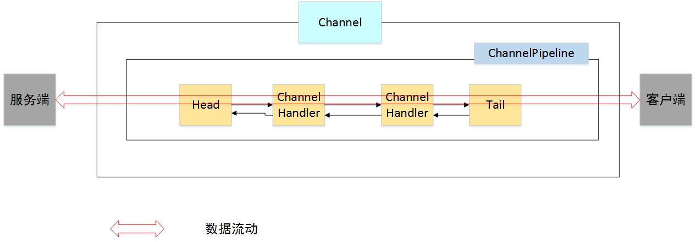

## ChannelPipeline和ChannelHandler学习
根据java NIO思想，不管是从文件中读写数据还是从网络中读写数据，都是借助于一个Channel来进行的。   
即：File <--> Channel <--> 程序  
在netty框架中，netty将Channel的数据管道（Channel中包含很多信息）抽象成一个ChannelPipeline，用于描述数据在管道中的流入流出。类比Java Web中的Filter和拦截器，可以在消息最终到达目的地之前可以对消息进行一个过滤和处理，那么netty框架中的消息在ChannelPipeline中流动和传递的时候，也是可以加一些“拦截器”对消息进行拦截并进行加工，在netty框架中起拦截消息作用的就是ChannelHandler。

### 1 ChannelPipeLine
ChannelPipeline是对数据管道的一个抽象，数据要想从网络达到程序或者从程序达到网络，必须经过ChannelPipeline才可以。   
但是在前面的例子中并没有直接绑定ChannelPipeline，从前面的描述当中可以猜测ChannelPipeline和Channel有关，因此可以猜想当绑定Channel的时候，可能也绑定了ChannelPipeline，即，当创建NioServerSocketChannel对象的时候会随带着创建一个ChannelPipeline对象，那么可以先看看当创建NioServerSocketChannel的时候都干了什么事情。会发现当创建NioServerSocketChannel对象的时候，会首先执行父类构造器，那么一直找，会发现会先执行NioServerSocketChannel的父类AbstractChannel的构造器。
```
//实例化NioServerSocketChannel
public NioServerSocketChannel(java.nio.channels.ServerSocketChannel channel) {
    super((Channel)null, channel, 16);
    this.config = new NioServerSocketChannel.NioServerSocketChannelConfig(this, this.javaChannel().socket());
}

//父类
protected AbstractNioMessageChannel(Channel parent, SelectableChannel ch, int readInterestOp) {
    super(parent, ch, readInterestOp);
}

//父类
protected AbstractNioChannel(Channel parent, SelectableChannel ch, int readInterestOp) {
    super(parent);
    ...
}

//父类
protected AbstractChannel(Channel parent) {
    this.parent = parent;
    this.unsafe = this.newUnsafe();
    this.pipeline = this.newChannelPipeline();
}
```
从这里可以发现，当创建一个NioServerSocketChannel对象的时候，会首先创建一个ChannelPipeline对象（DefaultChannelPipeline是ChannelPipeline的子类）：
```
//创建一个双向链表
protected DefaultChannelPipeline(Channel channel) {
    this.channel = (Channel)ObjectUtil.checkNotNull(channel, "channel");
    this.tail = new DefaultChannelPipeline.TailContext(this);
    this.head = new DefaultChannelPipeline.HeadContext(this);
    this.head.next = this.tail;
    this.tail.prev = this.head;
}
```
这个双向链表上的节点其实就是一个个的ChannelHandler。

因此，可以这么说，当客户端向服务端发送一个连接请求，或者客户端与服务端建立一个网络连接进行IO操作的时候，会首先创建一个Channel，前者创建的时NioServerSocketChannel,后者会创建一个NioSocketChannel，不管是何种Channel，在创建Channel对象的时候，会首先创建一个ChannelPipeline对象用于描述数据传输通道，并将其作为Channel的一个属性；在创建ChannelPipeline对象的时候，其内部又创建了一个双向链表，用于存储多个ChannelHandler，在数据从CHannelPipeline中流动的时候，对其进行拦截并进行加工或者处理。   
它们之间的关系如图所示：  


### 2 ChannelHandler

### 3 参考资料
[]()
