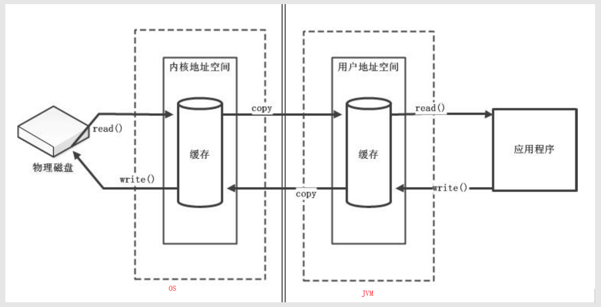
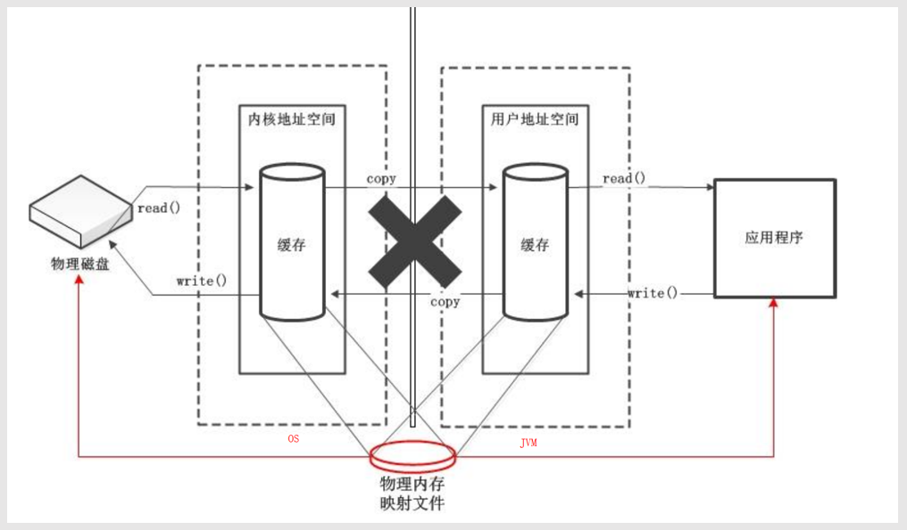

## ByteBuf学习
基于Java Nio的网络通信，必须依赖于ByteBuffer，从程序实际上是借助于ByteBuffer来与Channel进行交互的，可以向Channel读写数据，但是Java Nio原生的ByteBuffer存在一些问题。

ByteBuffer有两种模式：读模式和写模式，写模式切换到读模式的时候，必须显示地调用flip()方法，否则从缓冲区中读数据会出现异常。这就要求程序猿必须对ByteBuffer非常了解，在使用的时候非常小心才行，否则一不小心就会出错；另外ByteBuffer的长度是固定的，一旦分配之后，就不可更改，因此在使用的时候必须提前估计好，分多了浪费空间，分少了在写入多字节数据的时候可能会越界。

netty框架作为一个高可用框架，直接使用ByteBuffer来进行网络传输，因为ByteBuffer自身的局限性，可能会导致各种各样的问题，因此，netty对ByteBuffer进行扩展，形成了新的类ByteBuf，用于进行网络传输。


### 1 ByteBuf的基本原理

相比于ByteBuffer中仅仅使用一个指针来用于指向写操作或者读操作的当前位置，ByteBuf中的使用两个指针：readerindex和writerIndex。在初始状态下readerindex和writeindex均指向0，当向ByteBuf中写入数据的时候，writeindex会逐渐增加，readerindex不变；当从ByteBuf中读取数据的时候，readerindex会逐渐增加，writerindex不变；其中readerindex-writerindex范围是可读数据，writerindex-capacity范围是可写部分，0-readerindex就是已经读取的数据;maxCapacity表示的时可以动态扩展的最大字节数。

当调用discardReadBytes()方法的时候，会释放掉0-readerindex部分的数据，与此同时，移动readerindex到0，writeindex到writerindex-readerindex位置。

当调用clear()方法的时候，会重置readerindex和writerindex，均为0，但是ByteBuf中的数据并没有被清除

### 2 ByteBuf动态扩展

Java NIO中的ByteBuffer的长度是固定的，当缓冲区中的写入空间不足的时候，会抛出异常：BufferOverflowException。Netty中的ByteBuf是可以进行动态扩展的，在向ByteBuf中写入数据的时候，会首先判断写入空间是否够用，不够用的时候，会首先进行一个扩展。
```
public ByteBuf writeBytes(byte[] src, int srcIndex, int length) {
	//在可写空间不足的时候，进行扩展
    this.ensureWritable(length);
    this.setBytes(this.writerIndex, src, srcIndex, length);
    this.writerIndex += length;
    return this;
}

final void ensureWritable0(int minWritableBytes) {
    this.ensureAccessible();
    //可写空间足够，直接返回，不足执行if内语句
    if (minWritableBytes > this.writableBytes()) {
    	//扩展后的大小大于最大可以动态扩展的字节数，那么直接返回异常
        if (minWritableBytes > this.maxCapacity - this.writerIndex) {
            throw new IndexOutOfBoundsException(String.format("writerIndex(%d) + minWritableBytes(%d) exceeds maxCapacity(%d): %s", this.writerIndex, minWritableBytes, this.maxCapacity, this));
        } else {
        	//扩展
            int newCapacity = this.calculateNewCapacity(this.writerIndex + minWritableBytes);
            this.capacity(newCapacity);
        }
    }
}
```
### 3 ByteBuf的分类
ByteBuf按照类型可以分为：堆缓冲区类型和直接缓冲区类型。在这里先学习下直接缓冲区和非直接缓冲区。

**缓冲区**

直接缓冲区，是直接建立在物理内存中的，因为直接利用的时物理资源——内存，因此被称之为直接缓冲区。  
非直接缓冲区，是在java内存中的堆内存中建立一个缓冲区，由于没有直接利用物理内存，因此被称之为非直接缓冲区。  

java程序在运行过程中可以直接从物理内存中读取数据，也可以从JVM内存中读取数据，这里有一个区别就是，当存JVM内存中读取数据的时候，这些数据实际上是存放物理内存上的数据的一个副本。从网上的两个图可以看出。 图片来自:[《
NIO直接缓冲区与非直接缓冲区》](https://blog.csdn.net/jkxqj/article/details/77478267)：https://blog.csdn.net/jkxqj/article/details/77478267   
非直接缓冲区示意图：  


直接缓冲区示意图：    

从如中可以看出，当使用直接缓冲区时，那么程序是直接从物理内存中读写数据的，不存在像使用非直接缓冲区那样，先把数据拷贝到非直接缓冲区然后在进行读写，因此它的速度比非直接缓冲区要快；但是它是由OS来管理的，分配内存空间和释放内存比直接缓冲区缓冲区更复杂和慢。     
但是，非直接缓冲是JVM内存区域的一部分，因此由JVM管理，因此使用Java程序读写的时候，更加快速，也更加便于管理，但是每次读写数据都要先将数据拷贝到直接缓冲区再进行传递。  

堆缓冲区类型的ByteBuf实际上就是非直接缓冲区，它是建立在JVM中的堆内存中的；这里需要注意一点，在进行网络传输的时候，数据必须首先放到直接缓冲区中才行，因此使用堆缓冲区类型的ByteBuf，隐含着，在进行网络传输的时候，会多一步操作，就是会首先把数据刷新到直接内存上，然后再进行网络传输；    
直接缓冲区类型的ByteBuf实际上就是直接缓冲区，它是建立在物理内存中的。  

### 4 ByteBuf操作
ByteBuf的操作，java NIO中国的ByteBuffer类似，但是又有所不同。 

1.新建一个ByteBuf,使用Unpooled来创建，其中i表示初始容量：
```
堆缓冲区（heap Buffer）
Unpooled.buffer(int i)；
直接缓冲区（direct Buffer）
Unpooled.directBuffer(int i)；

//buffer(int i)会调用该方法
public ByteBuf heapBuffer(int initialCapacity) {
    return this.heapBuffer(initialCapacity, 2147483647);
}

//可以看到，缓冲区最大可分配容量是2147483647字节
public ByteBuf heapBuffer(int initialCapacity, int maxCapacity) {
    if (initialCapacity == 0 && maxCapacity == 0) {
        return this.emptyBuf;
    } else {
        validate(initialCapacity, maxCapacity);
        return this.newHeapBuffer(initialCapacity, maxCapacity);
    }
}
```

2.顺序读操作
```
public abstract byte readByte();
//读取var1.length字节的数据
public abstract ByteBuf readBytes(byte[] var1);
//读取数据到var1中，直至var中的数据到达limit
public abstract ByteBuf readBytes(ByteBuffer var1)
...
```
3.顺序写操作   
注意，在进行读写的时候，不用像ByteBuffer那样进行模式切换
```
//将参数var写入到ByteBuf中，如果var1可写字节数小于1，那么抛出异常
public abstract ByteBuf writeByte(int var1);
...
```
4.清空操作，使得readerindex和writerindex都归零，但是ByteBuf中的数据并没有清空
```
public abstract ByteBuf clear();
```
5.释放已读数据，discard()方法,此操作，会释放已读数据，并将writerindex归为writerindex-readerindex,readerindex归零
```
public ByteBuf discardReadBytes() {
    this.ensureAccessible();
    if (this.readerIndex == 0) {
        return this;
    } else {
        if (this.readerIndex != this.writerIndex) {
            this.setBytes(0, this, this.readerIndex, this.writerIndex - this.readerIndex);
            this.writerIndex -= this.readerIndex;
            this.adjustMarkers(this.readerIndex);
            this.readerIndex = 0;
        } else {
            this.adjustMarkers(this.readerIndex);
            this.writerIndex = this.readerIndex = 0;
        }

        return this;
    }
}
```
6.mark操作和reset操作
mark相当于在对ByteBuf读写的时候，使用mark打个标记，然后在继续操作，当想返回到刚刚打标记的那个地方的时候，调用reset即可。 
```
//打标记read
public abstract ByteBuf markReaderIndex();

public abstract ByteBuf resetReaderIndex();
//打标记write
public abstract ByteBuf markWriterIndex();

public abstract ByteBuf resetWriterIndex();
```
