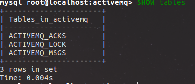

<!-- MarkdownTOC -->

- 1 P2P模型
- 2 Pub/Sub模型
- 3 两者区别
- 4 消息持久化方式

<!-- /MarkdownTOC -->


JMS支持两种消息传送模型，activemq作为JMS的一种实现，自然也支持这两种消息传送模型：P2P(点对点模型)，Pub/Sub(发布订阅模型)

### 1 P2P模型

消息从消息发送者把消息发送给MQ服务器，在此模型中，实际上是发送给MQ中的一个Queue对象，消息接受者从Queue对象中取出消息，之后Queue中不再保存该消息

在P2P模型中，一个Queue可以关联多个消息发送者和消息接受者，但是需要注意的是，Queue中的每一个消息只能被一个消息接受者接收。*如果消息一直没有被接收（消费），那么它将一直存放在数据库中，直至被消费*

JMS标准按照先来后到原则进行服务，如果一个Queue上面有多个消息接受者对其监听，那么最先监听的那个消息接受者获得该消息，如果没有消息接受者监听该Queue对象，那么Queue对象会首先把消息保存下来，等到有消息接受者监听的时候在发送给消息接受者。

P2P模型中，消息并不是由MQ服务器主动发给消息接收者的，而是消息接受者发出请求（receive()）之后，MQ发给他的。

### 2 Pub/Sub模型

消息发送者把消息发送给MQ服务器，在此模型中，实际上发送给MQ中的Topic对象，之后消息接受者从Topic对象中获取消息，与P2P不同的是，Topic中的一条消息可以被多个消息接受者获取。

该模型中的消息是由MQ主动发送给消息接收者的，当消息来到MQ服务器之后，MQ查看订阅此消息（实际上订阅消息发送者主题）的消息接受者的集合，依次给每一个对象都发送一个该消息。

在该模型中，订阅主题支持长期订阅，也就是说，在长期订阅的状态下，即使消息接受者没有在线此消息也不会丢失，当消息接受者重新上线之后，MQ会将此消息发送给他。

在进行长期订阅的时候，消息发送者要设置模式： `messageProducer.setDeliveryMode(DeliveryMode.PERSISTENT)//支持持久化`  *在设置该选型之后再去启动连接`connection.start()`*

消息接收者与普通的消息接收者不同：`session.createDurableSubscriber(目的地，消息接收者名字)`

### 3 两者区别


|         P2P         |       Pub/sub       |
|---------------------|---------------------|
| 发送目标是Queue对象 | 发送目标是Topic对象 |
|发送到MQ中的数据，MQ服务器默认会以文件形成持久化到磁盘中  |        默认情况下不进行持久化             |
|保证每条信息都能够被接收（可靠性强）|不保证每条信息都能被目标消息接受者接收|
|只能被一个消息接收者接收|可以被多个消息接收者接收|
|MQ被动发送消息|MQ主动发送消息|
|在消息被接收前消息不会丢失|只有监听Topic的消息接收者才能收到该消息，发送之后监听的不能收到该消息|

### 4 消息持久化方式

对于P2P模型，activeMQ默认是进行消息持久化的，默认情况下，会把消息以文件形式存放在Kahadb中的。
具体是在activemq.xml文件中配置的：
```
<persistenceAdapter>
    <kahaDB directory="${activemq.data}/kahadb"/>
</persistenceAdapter>
```
当然我们也可以自定义持久化方式，比如说把消息持久化到数据库中（mysql）

```
<persistenceAdapter>
	<jdbcPersistenceAdapter dataSource="#mysql-ds" />
</persistenceAdapter>
//省略...
<bean id="mysql-ds" class="org.apache.commons.dbcp2.BasicDataSource" destroy-method="close" >
	<property name="driverClassName" value="com.mysql.jdbc.Driver" />
	<property name="username" value="root" />
	<property name="url" value="jdbc:mysql://localhost:3306/activemq" />
	<property name="password" value="123" />
</bean>
```
这个时候，需要在${active}/lib/目录下添加架包mysql-connector-java-\*\*\*.jar和commons-dbcp-\*\*\*.jar，启动activemq之后会自动在activemq数据库中形成三张表,如图所示：



其中：

- ACTIVEMQ_ACKS 如果需要对Topic对象中的消息及进行持久化的时候，该表用于存储订阅者和MQ之间的关系：
```
+---------------+--------------+--------+-------+-----------+---------+
| Field         | Type         | Null   | Key   |   Default | Extra   |
|---------------+--------------+--------+-------+-----------+---------|
| CONTAINER     | varchar(250) | NO     | PRI   |    <null> |         |
| SUB_DEST      | varchar(250) | YES    |       |    <null> |         |
| CLIENT_ID     | varchar(250) | NO     | PRI   |    <null> |         |
| SUB_NAME      | varchar(250) | NO     | PRI   |    <null> |         |
| SELECTOR      | varchar(250) | YES    |       |    <null> |         |
| LAST_ACKED_ID | bigint(20)   | YES    |       |    <null> |         |
| PRIORITY      | bigint(20)   | NO     | PRI   |         5 |         |
| XID           | varchar(250) | YES    | MUL   |    <null> |         |
+---------------+--------------+--------+-------+-----------+---------+
```
- ACTIVEMQ_MSGS该表用于存放消息
```
+------------+--------------+--------+-------+-----------+---------+
| Field      | Type         | Null   | Key   |   Default | Extra   |
|------------+--------------+--------+-------+-----------+---------|
| ID         | bigint(20)   | NO     | PRI   |    <null> |         | 
| CONTAINER  | varchar(250) | NO     | MUL   |    <null> |         | //消息的destination
| MSGID_PROD | varchar(250) | YES    | MUL   |    <null> |         | //消息发送者主键
| MSGID_SEQ  | bigint(20)   | YES    |       |    <null> |         | //发送消息的顺序
| EXPIRATION | bigint(20)   | YES    | MUL   |    <null> |         |
| MSG        | longblob     | YES    |       |    <null> |         |  //消息实体（Java序列号的二进制数据）
| PRIORITY   | bigint(20)   | YES    | MUL   |    <null> |         |  //优先级
| XID        | varchar(250) | YES    | MUL   |    <null> |         |
+------------+--------------+--------+-------+-----------+---------+
```
- ACTIVEMQ_LOCK 资料上说是在集群上才有用

