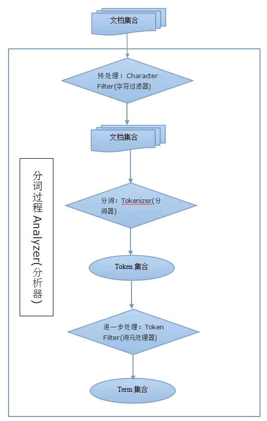

#### 1 ES分词流程



#### 2 ES分析器

ES的整个分析器有两部分组成：

- 过滤器：负责对文本进行过滤处理，并对文本进行自定义处理
- 分词器：负责对文本进行分词处理

ES分析器的主要工作流程是： 

- 由过滤器对文本进行过滤处理，这个时候我们可以添加一些自定义的操作。比如把表情符号换成对应为文字，将`&`符号转成`and,/,和`这种文字。
-  将过滤后的文本转交给分词器，进行分词处理。


下面是复制elastic参考官网：[自定义分词器](https://www.elastic.co/guide/cn/elasticsearch/guide/current/custom-analyzers.html)


一个分析器就是在一个包里面组合了三种函数的一个包装器， 三种函数按照顺序被执行:

**字符过滤器**

字符过滤器用来整理一个尚未被分词的字符串。例如，如果我们的文本是HTML格式的，它会包含像 <p> 或者 <div> 这样的HTML标签，这些标签是我们不想索引的。我们可以使用 html清除字符过滤器来移除掉所有的HTML标签，并且像把 &Aacute; 转换为相对应的Unicode字符 Á 这样，转换HTML实体。一个分析器可能有0个或者多个字符过滤器。

**分词器**
一个分析器 必须 有一个唯一的分词器。 分词器把字符串分解成单个词条或者词汇单元。 标准 分析器里使用的 标准 分词器 把一个字符串根据单词边界分解成单个词条，并且移除掉大部分的标点符号，然而还有其他不同行为的分词器存在。例如， 关键词 分词器 完整地输出 接收到的同样的字符串，并不做任何分词。 空格 分词器 只根据空格分割文本 。 正则 分词器 根据匹配正则表达式来分割文本 。

**词单元过滤器**
经过分词，作为结果的 词单元流 会按照指定的顺序通过指定的词单元过滤器 。词单元过滤器可以修改、添加或者移除词单元。我们已经提到过 lowercase 和 stop 词过滤器 ，但是在 Elasticsearch 里面还有很多可供选择的词单元过滤器。 词干过滤器 把单词 遏制 为 词干。 ascii_folding 过滤器移除变音符，把一个像 "très" 这样的词转换为 "tres" 。 ngram 和 edge_ngram 词单元过滤器 可以产生 适合用于部分匹配或者自动补全的词单元。


#### 3  自定义分析器

```
PUT my-custom
{
  "settings": {
    "analysis": { 
      "char_filter": {  
        "&_and":{     //在这里自定义一套char 过滤器
          "type":"mapping",
          "mappings":["&=>and"]    //将&符号替换成and
        }
      },
      "analyzer": {
        "my-custom-ana":{    //自定义一个分析
          "type":"custom",
          "char_filter":  [ "&_and" ],  //char过滤器使用自定义的
          "tokenizer":    "standard",
          "filter":       [ "lowercase"]   //词元过滤器使用内置的
        }
      }
    }
  }
}
```

#### 4 ES内置分析器

``` shell
1. standard analyzer
2. simple analyzer
3. stop analyzer
4. keyword analyzer
5. pattern analyzer
6. language analyzer
7. ssnowball analyzer
8. custom analyzer
9. standard tokenizer
10. edge ngram tokenizer
11. keyword tokenizer
12. letter analyzer
13. lowercase analyzer
14. ngram analyzer
15. swhitespace analyzer
16. pattern analyzer
17. uax email url analyzer
18. path hierarchy analyzer
```

#### 5 ES内置过滤器

```shell
1. standard  filter
2. ascii  folding  filter
3. length  filter
4. lowercase  filter
5. ngram filter
6. edge ngram filter
7. porter stem filter
8. shingle filter
9. stop filter 
10. stopword delimiter filter
11. stemmer token filter
12. stemmer override filter
13. keyword marker filter
14. keyword repeat filter
15. kstem filter
16. snowball filter
17. phonetic filter
18. synonym filter
19. compound word filter
20. reverse filter
21. elision filter
22. truncate filter
23. unique filter
24. pattern capture filter
25. pattern replace filter
26. trim filter
27. limit token count filter
28. hunspell filter
29. common grams filter
30. normalization filter
```

#### 6 ES内置的字符过滤器

```shell
1. mapping char filter 根据配置的映射关系替换字符
2. html strip char filter 去掉HTML元素
3. pattern replace char filter 用正则表达式处理字符串
```