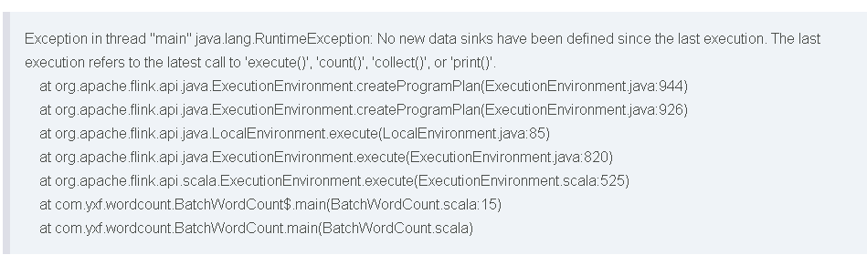
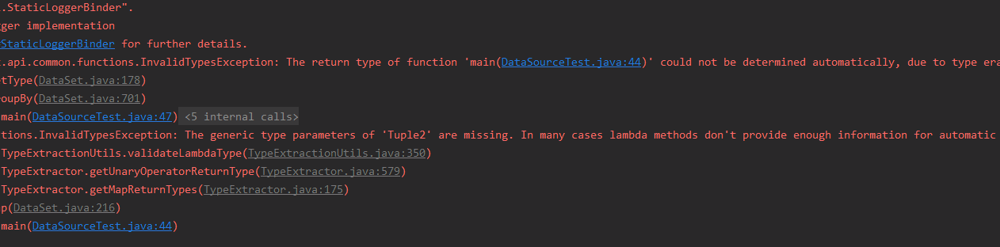
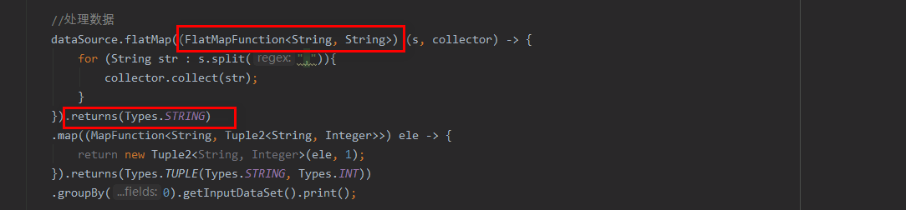

#### 1 flink处理批数据

```java
//用于定义批数据的执行环境
ExecutionEnvironment env = ExecutionEnvironment.getExecutionEnvironment();

//读取数据
List<String> data = new ArrayList<>(16);
Random random = new Random();
for (int i = 1; i <= 10; i++){
    String str = i + "," + random.nextInt(11);
    data.add(str);
}
DataSource<String> dataSource =  env.fromCollection(data);

//处理数据
dataSource.flatMap((FlatMapFunction<String, String>) (s, collector) -> {
        for (String str : s.split(",")){
            collector.collect(str);
        }
    }).returns(Types.STRING)
    .map((MapFunction<String, Tuple2<String, Integer>>) ele -> {
        return new Tuple2<String, Integer>(ele, 1);
    }).returns(Types.TUPLE(Types.STRING, Types.INT))
    .groupBy(0)
    .sum(1)
    .print();

/**
groupBy(0) 聚合操作，由于进行聚合的数据是二元组元素，这里按照二元组中的第一个元素为标准进行聚合
sum(1) 对于聚合后的数据，对二元组中第一个元素相同的数据，对第二个元素进行累加操作
*/

//env.execute("test-lp");
```

#### 2 流数据处理

```java
//创建执行环境
StreamExecutionEnvironment env = StreamExecutionEnvironment.getExecutionEnvironment();

//数据处理
env.socketTextStream("localhost", 8888)
    .flatMap((FlatMapFunction<String, String>) (s, collector) -> {
        for (String str : s.split(",")) {
            collector.collect(str);
        }
    }).returns(Types.STRING)
    .map((MapFunction<String, Tuple2<String, Integer>>) s -> {
        return new Tuple2<String, Integer>(s, 1);
    }).returns(Types.TUPLE(Types.STRING, Types.INT))
    .keyBy(0)
    //10s统计一次，每次统计过去5s内的数据
    .timeWindow(Time.seconds(10), Time.seconds(5))  
    .sum(1)
    .print();

//程序执行
env.execute("ssss");
```

在使用`nc`命令开启一个服务器：

```shell
nc -l -p 8888 -v

#输入一些数据
```

#### 3 编写Flink程序遇到的问题

- **问题1: 重复调用`env.exec()`**

  这个问题是因为flink中的`print、count、collect`方法，在调用时，会自动触发`env.execute()`方法的执行，这个时候，程序中如果在调用print方法后，又紧跟一个`env.execute`方法就会出现这个异常。

  解决办法就是，一旦调用了`print、count、collect`方法，就不要显示再调用`env.execute`。

- **问题2:类型换行错误问题**

  

  这个问题是因为使用Java lambda表达式时，在数据转换时，无法确定类型导致的。

  解决办法：声明类型、调用returns方法声明返回值类型，如下所示：

  


