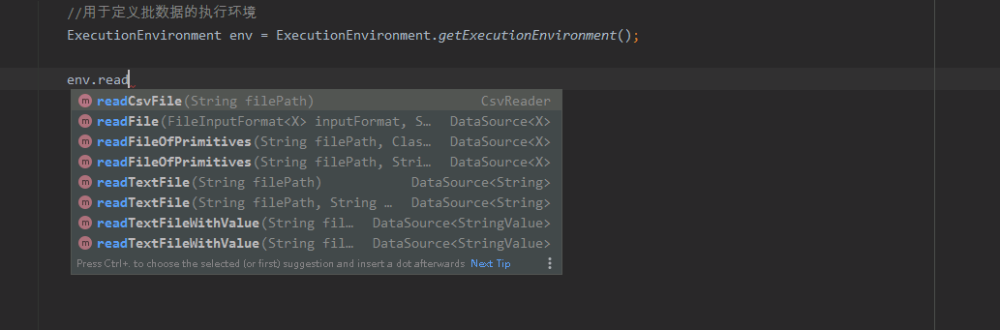
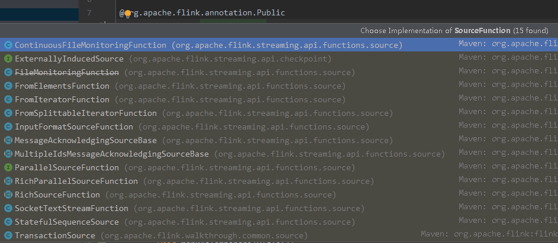
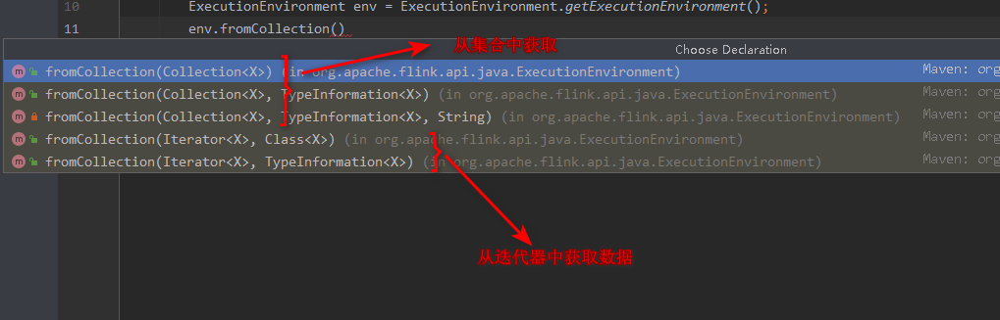
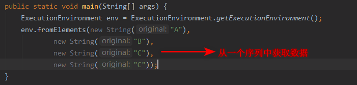
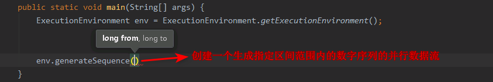
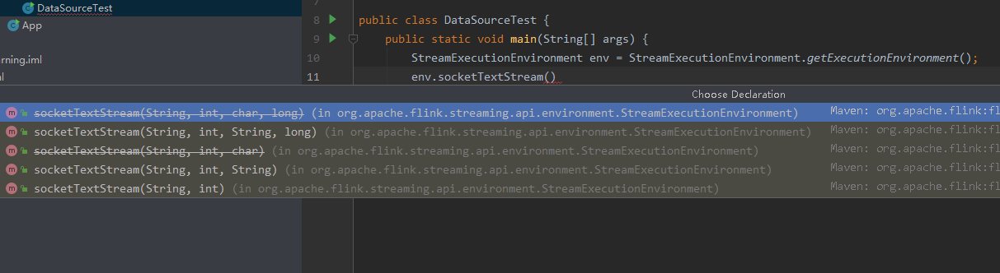
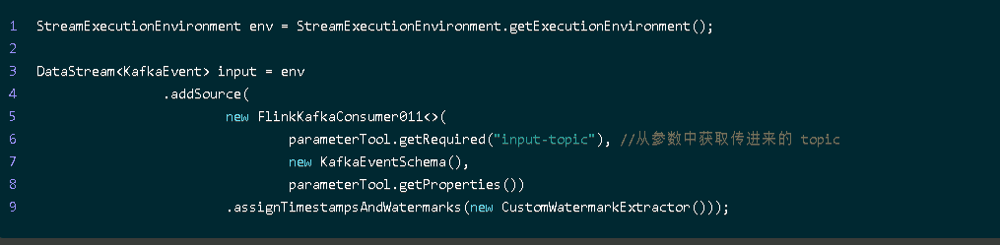
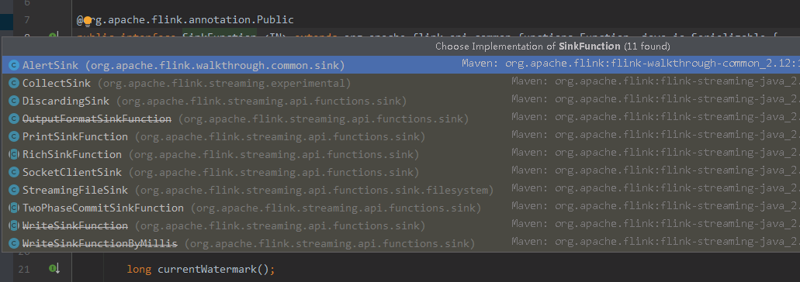
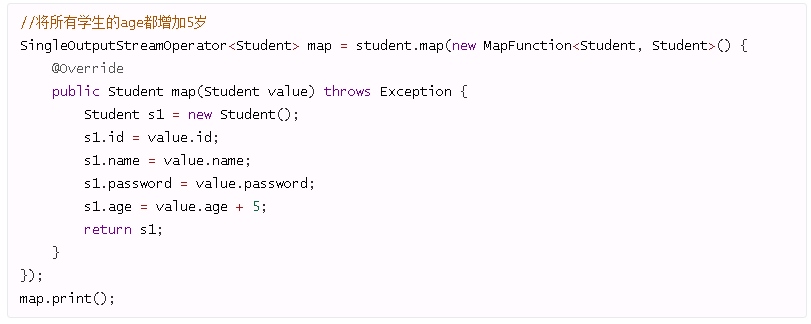

学习教程： [**zhisheng17/flink-learning**](https://github.com/zhisheng17/flink-learning)

#### 1 flink应用示例图

flink在生产环境中的位置


#### 2 data source

data source就是数据源，用于定义flink中要处理的数据的来源。

由于flink既可以处理批数据，又可以处理流数据，因此可以通过不通的方式去获取数据。

```java
//用于定义批数据的执行环境
ExecutionEnvironment env = ExecutionEnvironment.getExecutionEnvironment();
//用于定义流数据的执行环境
StreamExecutionEnvironment streamEnv= StreamExecutionEnvironment.getExecutionEnvironment();
```

**获取批数据**

flink批数据主要是从一个已知的文件中获取，比如可以从txt、csv等文件中进行获取，如下所示。



**获取流数据**

flink通过`SourceFunction`来表示流数据。flink获取流数据的方式如下：

```java
//定义执行环境
StreamExecutionEnvironment env = StreamExecutionEnvironment.getExecutionEnvironment();

//定义流数据
env.addSource({一个SourceFunction对象})
```

用户可以通过SourceFunction接口自定义流数据对象，也可以使用Flink中已经实现好的SourceFunction对象，如下所示。



总的来说，flink可以通过如下几种方式来获取数据源：

- 批处理
  - 通过集合方式获取
    - 
    - 
    - 
  - 通过文件获取数据流，上面已经说过

- 流处理

  - 通过socket进行获取，如图所示，通过传入一个主机ip字符串和端口号，进行监听socket数据流。

  - 通过SourceFunction自定义数据流

    

#### 3 data sink

整体而言，flink处理数据的流程大体分为三步：从data source中获取数据、处理数据、将处理结果存放在data sink中。如图所示


这个 sink 的意思也不一定非得说成要把数据存储到某个地方去。其实官网用的 Connector 来形容要去的地方更合适，这个 Connector 可以有 MySQL、ElasticSearch、Kafka、Cassandra RabbitMQ 等。

在flink中，通过`SourceFunction`来表示数据的Sink，并且Flink已经定义好了几种常用的Sink实现类。



#### 4 flink data transformation 

Flink应用程序的整体结构是：

- source，即数据源，用于获取数据。Flink获取数据源的方式主要有四种：
  - 基于本地集合的source
  - 基于文件的source
  - 基于网络套接字的source
  - 自定义的source。自定义的source常见的有：kafka、RabbitMQ、Twitter Streaming API等等。
- Transformation，即数据转换，用于对获取的数据进行各种操作，以便得到我们想要的数据。常见的transformation有：map、flatMap、Filter、keyBy、reduce、aggregation、window、windowAll、union、split、select等等。
- sink，数据接收器，即Flink计算后的数据要发送的目的地。Flink常见的sink有如下几类：
  - 写入文件
  - 在终端打印出来
  - 写入socket
  - 自定义sink，自定义的sink比较常见的有：kafka、ES、HBase、MySQL、HDFS等等。

以map为例，来简单介绍数据是如何进行转换的。



#### 5 flink的window机制

目前有许多数据分析的场景从批处理到流处理的演变， 虽然可以将批处理作为流处理的特殊情况来处理，但是分析无穷集的流数据通常需要思维方式的转变并且具有其自己的术语。例如：

- windowing（窗口化）
- at-least-once（至少一次）
- exactly-once（只有一次）

对于刚刚接触流处理的人来说，这种转变和新术语可能会非常混乱。 Apache Flink 是一个为生产环境而生的流处理器，具有易于使用的 API，可以用于定义高级流分析程序。

Flink 的 API 在数据流上具有非常灵活的窗口定义，使其在其他开源流处理框架中脱颖而出。本文将讨论用于流处理的窗口的概念，介绍 Flink 的内置窗口，并解释它对自定义窗口语义的支持。

#### 6 flink对Time的定义

在flink中，大致对事件定义了三类时间属性：

- `Event Time`：事件产生的时间，一般就是事件自身携带的时间，event time取决于事件自身，与其他因素无关。
- `Ingestion Time`：事件进入Flink的时间
- `Process Time`：事件被flink开始处理的时间

下面是一张关于这三类时间的关系图。


