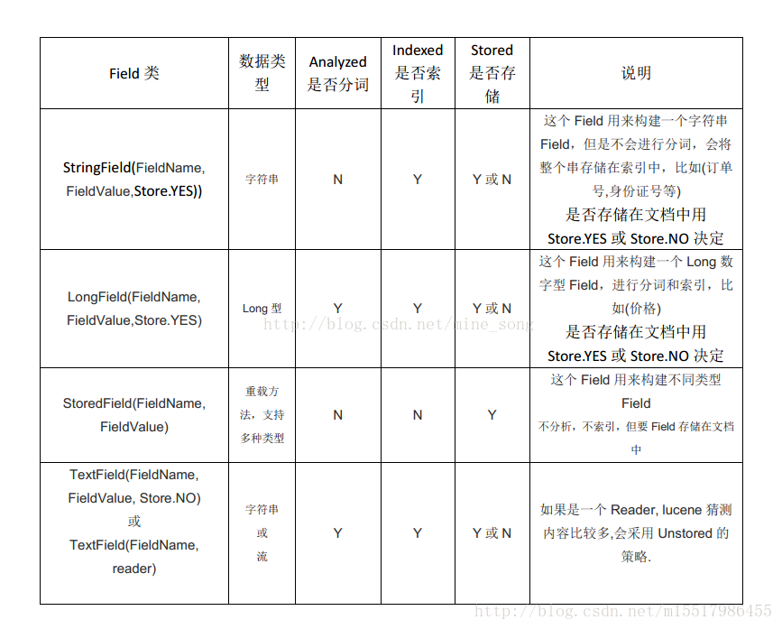

<!-- MarkdownTOC -->

- 1 通过Lucene创建索引
- 2 搜索
- 3 更新索引
- 4 删除索引
- 5 查看分词器的分词效果

<!-- /MarkdownTOC -->


### 1 通过Lucene创建索引
```java
/**
创建Lucene索引
**/
public void createIndex(Path path)throws IOException {
	//这里制定索引的存放位置
    Directory directory = FSDirectory.open(path);

    /**
    这里基于索引写配置，配置一个分词器
    常用的分词器有：SimpleAnalyzer(以空格为分隔，这种分词对英文比较友好，在对中文进行分词时，意义不大),
    IKAnalyzer，是一种比较常用的中文分词器，能够有效地按照中文习惯对汉字字符串进行分词;
    **/
    IndexWriterConfig config = new IndexWriterConfig(new IKAnalyzer());

    //创建一个索引写对象
    IndexWriter writer = new IndexWriter(directory,config);

    //Lucene中文档是索引和搜索的基本单元，创建索引实际上就是添加一个个的文档对象，搜索也是返回一个文档对象集合
    Document document = new Document();

    //Field是Lucene存储的最小单元，一个文档实际上就是Field的集合
    /**
    Lucene中有很多Filed的实现类，其中比较常用的是：StringField、TextField、StoreField、LongField等
    这些实现类的区别，如下图所示
    **/
    document.add(new TextField("title","今天的天气", Field.Store.YES));
    document.add(new TextField("content","晴天加大风，温度18摄氏度", Field.Store.YES));

    //将创建好的文档对象由索引写对象将其添加到索引中
    writer.addDocument(document);
    writer.close();
}
```

Field的实现类的区别:


**使用IKAnalyzer时，需要注意的事项**  
官方提供的IKAnalyzer jar包并不能够完美兼容Lucene5以上的版本，原因是由于Lucene5以上之后，Analyzer和Tokenizer类的方法有改动，导致IKAnalyzer中继承这两个类的子类无法正常提供服务。因此可以使用这个哥们维护的IKAnalyzer项目：[blueshen/ik-analyzer](https://github.com/blueshen/ik-analyzer)。


### 2 搜索
```java
public void search(Path path) throws  IOException{
	//指定索引所在位置
    Directory directory = FSDirectory.open(path);
    IndexReader reader = DirectoryReader.open(directory);

    //创建一个索引检索对象
    IndexSearcher searcher = new IndexSearcher(reader);

    /**
    创建一个查询条件，在这里又引入了一个新的概念Term
    Lucene中term是搜索语法的最小单元，复杂的查询条件均会分解成term查询的集合；
    **/
    //这里不会对查询关键字进行分词处理
    Query query = new TermQuery(new Term("content","大风"));

    /**
    有时候，我们可能需要对查询关键字进行分词处理，
    比如搜索："热水是否包治百病"，对其分词搜索可能效果更好
    **/
    /**
    //这里指定，对文档的哪个Field进行检索，指定检索关键字使用的分词器
    QueryParser queryParser = new QueryParser("descs",analyzer);
    Query  query = queryParser.parse("sunny");
    TopDocs hits =  searcher.search(query,10);
    **/

    //真正执行查询，并且返回指定数量的文档集合
    TopDocs topDocs = searcher.search(query,10);

    //变量文档集合，获取文档中的内容Field
    for (ScoreDoc hit : topDocs.scoreDocs){
        Document doc = searcher.doc(hit.doc);
        System.out.println(doc.get("title"));
        System.out.println(doc.get("content"));
    }
}
```

### 3 更新索引
```java
/**
Lucene中虽然有update索引的接口，但是根据实际的操作结果来看，update并不是修改已有文档内容，而是
直接往集群中添加一个新文档，原有文档仍然存在，也仍然可以被搜素
因此要想真正实现Lucene中的update操作，我的想法是，先查询到目标文档，然后删除，然后，在往索引
中添加一个修改后的文档，文档要求有所有field的内容
**/
public void updateIndex(Path path) throws  IOException{
    Directory directory = FSDirectory.open(path);
    IndexWriterConfig config = new IndexWriterConfig(new IKAnalyzer());
    IndexWriter indexWriter = new IndexWriter(directory,config);

    Document document = new Document();
    document.add(new TextField("title","sdaasdsa", Field.Store.YES));
    document.add(new TextField("content","sdajksajsalkjasl天气大风",Field.Store.YES));
    indexWriter.updateDocument(new Term("content","第"),document);

    //必须有这两步，否则执行不生效
    indexWriter.commit();
    indexWriter.close();
}
```

### 4 删除索引
```java
public void deleteIndex(Path path) throws IOException{
    Directory directory = FSDirectory.open(path);
    IndexWriterConfig config = new IndexWriterConfig(new IKAnalyzer());
    IndexWriter indexWriter = new IndexWriter(directory,config);

    /**
     * 删除所有文档
     */
//        indexWriter.deleteAll();
	
	//先搜索title中包含“天气”的所有文档，然后删除
    indexWriter.deleteDocuments(new TermQuery(new Term("title","今天")));

    //必须有这两步，否则执行不生效
    indexWriter.commit();
    indexWriter.close();
}
```

### 5 查看分词器的分词效果
```java
public void tokenResult(String content, Analyzer analyzer) throws IOException{
		//对content，使用analyzer对其进行分词
        TokenStream tokenStream =  analyzer.tokenStream("content",content);
        CharTermAttribute attr = tokenStream.addAttribute(CharTermAttribute.class);
        //必须进行一次重置操作
        tokenStream.reset();

        //打印分词效果
        while (tokenStream.incrementToken()){
            System.out.println(attr.toString());
        }
    }
```