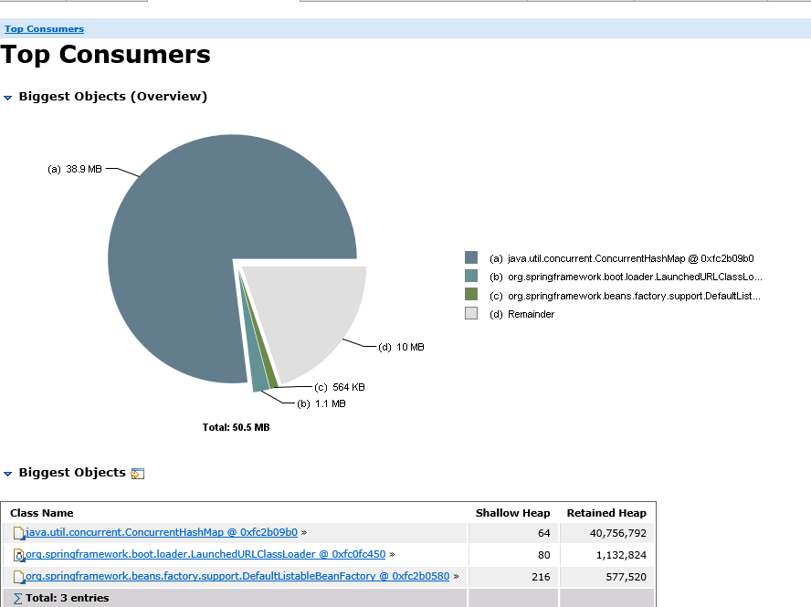
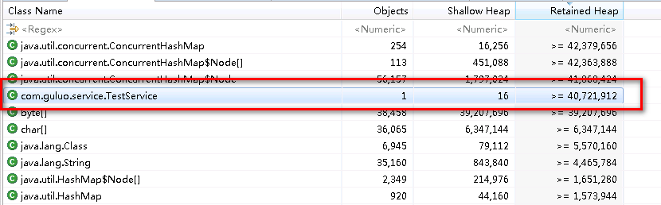
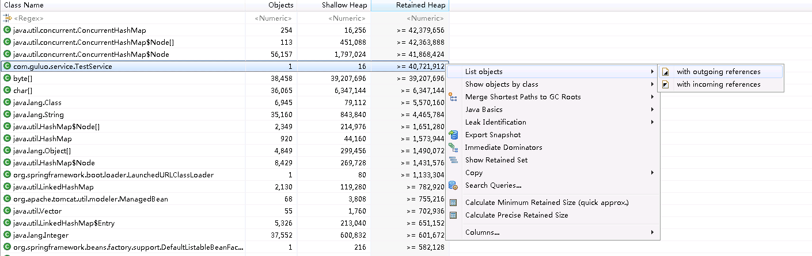
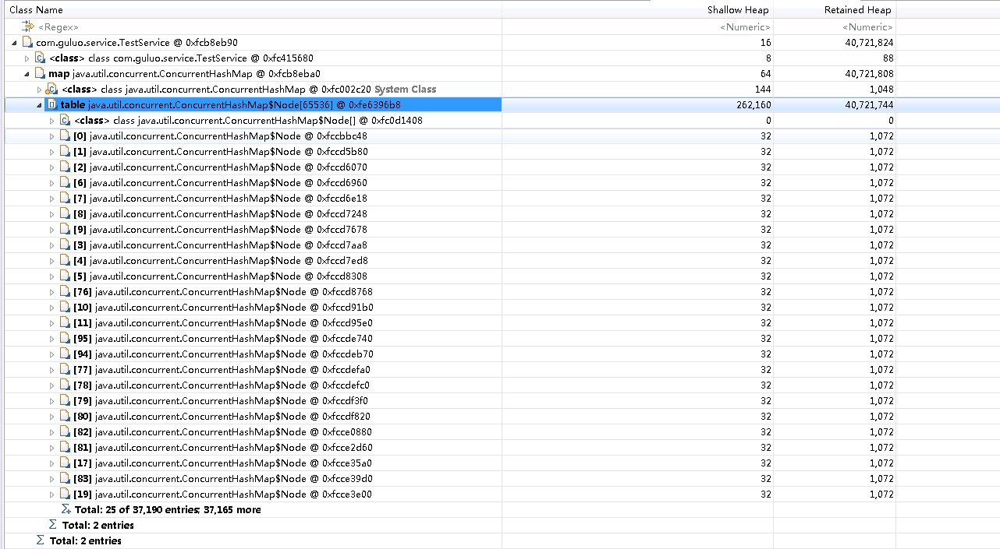

当Java程序中堆内存使用率一直很高，且不下降时，如何定位是那一段程序出现了问题？

#### 1 Demo程序

程序的主要思路就是，每发送一次请求，就会往`ConcurrentHashMap`中put一个value长度为1k的KV对。这样随着请求的不断增加，势必会造成程序中的内存资源被耗尽，具体表现就是Java程序的老年代使用率超过90%，程序出现卡死。

主要代码如下：

```java
//controller
@RestController
@RequestMapping("/test")
public class TestController {
    @Autowired
    private TestService service;

    @RequestMapping("/test")
    public String test() {
        String result = service.test();
        return result;
    }
}

//service
@Service
public class TestService {
    private ConcurrentHashMap<Integer, byte[]> map = new ConcurrentHashMap<>();

    public String test() {
        this.put();
        return "OK....." + this.map.size();
    }

    public void put(){
        while(true) {
            int key = map.size();
            if (map.get(key) == null){
                if (map.putIfAbsent(key, new byte[1024]) == null){
                    break;
                }
            }
        }
    }
}
```

现在就基于本程序，分析到底是哪一段代码会造成内存资源被超支使用。

把程序打成test.jar包，执行`java -Xms64m -Xmx64m -jar test.jar`，给该Java程序分配64m的堆内存，分配这么小的目的就是为了尽快出现问题。程序启动之后，不断的往该程序发送请求，直至内存资源被耗尽。

#### 2 出现问题时的内存情况

```shell
#使用jmap -heap {pid}可以查看对应Java程序的内存使用情况
jmap -heap 147365

#结果
Attaching to process ID 147365, please wait...
Debugger attached successfully.
Server compiler detected.
JVM version is 25.231-b11

using thread-local object allocation.
Parallel GC with 8 thread(s)

Heap Configuration:
   MinHeapFreeRatio         = 0
   MaxHeapFreeRatio         = 100
   MaxHeapSize              = 67108864 (64.0MB)
   NewSize                  = 22020096 (21.0MB)
   MaxNewSize               = 22020096 (21.0MB)
   OldSize                  = 45088768 (43.0MB)
   NewRatio                 = 2
   SurvivorRatio            = 8
   MetaspaceSize            = 21807104 (20.796875MB)
   CompressedClassSpaceSize = 1073741824 (1024.0MB)
   MaxMetaspaceSize         = 17592186044415 MB
   G1HeapRegionSize         = 0 (0.0MB)

Heap Usage:
PS Young Generation
Eden Space:
   capacity = 9437184 (9.0MB)
   used     = 9421392 (8.984939575195312MB)
   free     = 15792 (0.0150604248046875MB)
   99.83266194661458% used
From Space:
   capacity = 6291456 (6.0MB)
   used     = 0 (0.0MB)
   free     = 6291456 (6.0MB)
   0.0% used
To Space:
   capacity = 6291456 (6.0MB)
   used     = 0 (0.0MB)
   free     = 6291456 (6.0MB)
   0.0% used
PS Old Generation
   capacity = 45088768 (43.0MB)
   used     = 45054616 (42.967430114746094MB)
   free     = 34152 (0.03256988525390625MB)
   99.92425608080487% used

13877 interned Strings occupying 1975544 bytes.
```

从jmap的执行结果中可以看到，尤其是老年代内存使用率几乎达到了100%。

#### 3 分析

为了了解对象在内存中的具体情况，可以借助于`jmap`和`MAT`来进行分析。MAT是Eclipse开发的Java内存分析工具，可以基于该工具打开jmap导出的内存文件，提取其中的内存信息，以一种非常友好的方式呈现给用户。

首先通过命令`jmap -dump:live,format=b,file=test.hprof  147365`导出内存快照文件，后缀名需要是`hprof`。

接下来，去[MAT官网](https://www.eclipse.org/mat/downloads.php)下载MAT工具，解压可用。Windows环境下，双击{MAT_HOME}下的MemoryAnalyzer.exe文件即可，如果导出的hprof文件很大，MAT默认的内存大小，不足以支撑打开改文件，可以在MemoryAnalyzer.ini中修改内存配置。

通过MAT打开hprof文件之后，观察各个模块：

##### 3.1 Top consumers模块



从这个图中可以看出来，占用内存最多的对象是`ConcurrentHashMap`对象，引用的对象总大小达40M。而整个程序的堆内存才64M，因此此时可以推测极有可能是该对象导致的问题。

##### 3.2 Histogram模块

该模块主要展示内存中对象的详细情况，包括对象所属的类，对象个数，对象自身的大小以及引用的对象的大小



这里我按照`Retained Heap`降序显示，即按照引用对象的大小来进行排序，可以发现TestService对象在内存中仅有一个，且这个类是我们自己写的，但是它引用的对象大小达40M。有此可以推测是该类存在问题。

在分析的时候，要优先考虑我们自己编写的代码可能存在问题。

##### 3.3 List Objects

猜测`TestService`类存在问题，那么右击该类，查看这个类的list objects情况。



点击incoming reference，可以看到如下情况：



从图中可以看出来在`TestService`类中确实引用了`ConcurrentHashMap`,再结合Top consumers模块中占内存最多的对象是`ConcurrentHashMap`,因此基本可以确定是`TestService`中引用的`ConcurrentHashMap`存在问题。

##### 3.4 程序分析

```java
@Service
public class TestService {
    private ConcurrentHashMap<Integer, byte[]> map = new ConcurrentHashMap<>();

    public String test() {
        this.put();
        return "OK....." + this.map.size();
    }

    public void put(){
        while(true) {
            int key = map.size();
            if (map.get(key) == null){
                if (map.putIfAbsent(key, new byte[1024]) == null){
                    break;
                }
            }
        }
    }
}
```

`TestService`中确实有引用`ConcurrentHashMap`，再结合代码分析，`TestService`对象为所有线程共享，其成员变量map对象也为所有线程所共享，因此随着不断有请求的到来，map中添加的KV对也就越来越多，必然会导致内存被占满。

至此问题分析完毕。