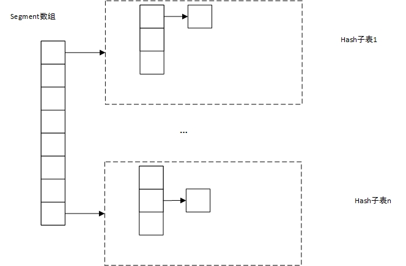
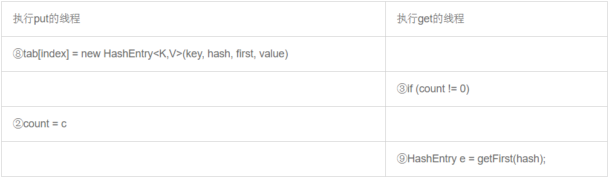

## ConcurrentHashMap

### 1 为什么要用ConcurrentHashMap集合

集合弥补了数组长度固定的缺陷，通过集合可以不必像数组一样，事先确定长度，这有很强的便利性。Map是一种key-value对集合，实际上在编程过程中，会用到大量的key-value对形式的数据结构，这个时候将其存入到Map集合中，非常便于管理。  
Map是一个接口，下面最常用的实现类是HashMap,它在底层是通过Hash表数据结构来存储存放的key-value对，取数据的时候，直接通过key的hash值，再根据hash函数，快速获取对应的value值。  
但是HashMap存在一个问题，那就是在多线程环境下不是线程安全的,先来看看HashMap的数据结构，HashMap内部是一个Hash表，Hash表实际上是由一个由Entry元素构成的数组和一个由Entry元素构成的链表两部分构成，Entry数组是HashMap的主干。

HashMap是根据key的Hash值来决定key-value存放在哪个Entry中的，具体做法是，首先根据key的Hash值确定在Entry数组下标，如果这个节点正好没有存值的话，那就吧key-value存进去，如果有值的话，根据解决Hash冲突策略，将其添加到以该数组下标节点为头结点的链表尾部。

根据HashMap的内部结构可以看出来，在单线程环境下，没有任何问题，但是多线程环境下就不行了，举个例子，当线程A向HashMap中插入数据，此时线程B也向HashMap中插入一个数据，加入他们两个的key的Hash值一样，那么都会首先找到对应数组节点，再以该节点为头节点，遍历链表，找到尾节点Entry，再修改Entry的next指向自己,但是后如果A和B同时拿到Entry的next,修改指向自己，那么后刷新到主内存的那个会覆盖前者，最终仅仅插入了一个key-value对。

为了解决这个问题，人们设计了Hashtable,Hashtable的内部结构和HashMap完全一样，但是，在对Hashtable进行put,remove，get的时候都会上锁，这样可以保证即使再多线程环境下，也是线程安全的。
```
//Hashtable类的put、get、remove方法签名
public synchronized V put(K key, V value) {}

public synchronized V get(Object key){}

public synchronized V remove(Object key)
```
实际上不止这几个方法，Hashtable中几乎所有的方法都是synchronized生命的，但是这样存在另外一个问题，性能下降。举个例子，假如一个Hashtable非常大，并且每个节点查询给长耗时，那么线程在对get操作的时候，其他想对该Hashtable操作的线程就不得不等待，而且极有可能相当长时间内不能对Hashtable进行操作，这对高响应度需求而言，绝对不能忍受。

这个时候，人们就提出了ConcurrentHashMap集合，ConcurrentHashMap集合的get操作根本不用加锁，那么再get过程中，其他线程仍然可以对ConcurrentHashMap进行其他操作，另外ConcurrentHashMap采用分段锁技术，将一个大Hash表拆分成多个hash子表，然后ConcurrentHashMap的上锁对象是这些子表，这就保证了再进行remove和put操作的时候，锁定的仅仅是一部分，其他线程仍然可以对其他子表进行操作，这样就会大大提高效率。

### 2 ConcurrentHashMap的实现原理

这里看的源码是jdk 1.7。ConcurrentHashMap内部实际上是由Segment数组和Hash表两部分组成，每个Segment元素对应一个Hash表，segment数组中的每个Segment元素充当对应Hash表的锁。 



ConcurrentHashMap会根据key的Hash值，确定该放在哪个Segment对应的Hash表中，然后再次根据key的Hash值确定再Hash子表中的存放位置，解决Hash冲突的办法和HashMap一致。

那么ConcurrentHashMap是如何保证再多线程环境下安全的？  
先看put操作，ConcurrentHashMap会首先根据key的Hash值确定对应的Segment数组下标，然后委托Segment元素，由其执行put操作：
```
final V put(K key, int hash, V value, boolean onlyIfAbsent) {
			//先上锁，锁定的是Segment对应的Hash表，并没有锁定整个ConcurrentHashMap
            HashEntry<K,V> node = tryLock() ? null :
                scanAndLockForPut(key, hash, value);
            V oldValue;
            try {
                HashEntry<K,V>[] tab = table;
                //确定HashEntry数组下标
                int index = (tab.length - 1) & hash;
                //以该节点为链表的头结点
                HashEntry<K,V> first = entryAt(tab, index);
                //将最新的key-value对放到对应链表尾部
                for (HashEntry<K,V> e = first;;) {
                    if (e != null) {
                        K k;
                        if ((k = e.key) == key ||
                            (e.hash == hash && key.equals(k))) {
                            oldValue = e.value;
                            if (!onlyIfAbsent) {
                                e.value = value;
                                ++modCount;
                            }
                            break;
                        }
                        e = e.next;
                    }
                    else {
                        if (node != null)
                            node.setNext(first);
                        else
                            node = new HashEntry<K,V>(hash, key, value, first);
                        int c = count + 1;
                        if (c > threshold && tab.length < MAXIMUM_CAPACITY)
                            rehash(node);
                        else
                            setEntryAt(tab, index, node);
                        ++modCount;
                        //对应Segment的Hash表的size加1
                        count = c;
                        oldValue = null;
                        break;
                    }
                }
            } finally {
            	//释放锁
                unlock();
            }
            return oldValue;
        }
```
从上面的代码可以看出，再对ConcurrentHashMap进行put操作的时候，仅仅锁定其中部分，即对应的Hash子表，对于ConcurrentHashMap中的其他的Hash子表，其他线程仍然是访问的，不受这个的影响。

再看看remove操作,该操作和get操作的原理类似，就是首先根据key的Hash值找到对应的Segment数组下标，然后委托对应的Segment来进行remove操作
```
inal V remove(Object key, int hash, Object value) {
			//上锁
            if (!tryLock())
                scanAndLock(key, hash);
            V oldValue = null;
            try {
            	//这是Segment对应的那个Hash子表
                HashEntry<K,V>[] tab = table;
                //确定对应的HashEntry数组下标
                int index = (tab.length - 1) & hash;
                //以该数组元素为链表头结点
                HashEntry<K,V> e = entryAt(tab, index);
                HashEntry<K,V> pred = null;
                //遍历对应链表，找到符合条件的节点，删除，删除方式和删除链表节点方式一样
                while (e != null) {
                    K k;
                    HashEntry<K,V> next = e.next;
                    if ((k = e.key) == key ||
                        (e.hash == hash && key.equals(k))) {
                        V v = e.value;
                        if (value == null || value == v || value.equals(v)) {
                            if (pred == null)
                                setEntryAt(tab, index, next);
                            else
                                pred.setNext(next);
                            ++modCount;
                            //把对应Segment所属的的Hash子表的size减1
                            --count;
                            oldValue = v;
                        }
                        break;
                    }
                    pred = e;
                    e = next;
                }
            } finally {
            	//释放锁
                unlock();
            }
            return oldValue;
        }
```
从上面的代码中可以看出来，对ConcurrentHashMap进行remove操作的时候，也是需要上锁的，但是仅仅锁定的也不是ConcurrentHashMap全部，仅仅是其中一个Hash子表，对于ConcurrentHashMap中的其他的Hash子表，其他线程仍然是访问的，不受这个的影响。  
但是其他线程如果这个时候也要对该Hash子表进行put或者remove操作的时候，就不得不等待了，因为锁已经被拿走了，没有锁，是无法访问的。

再看看get操作 
get操作不需要上锁，就可以直接访问，那么ConcurrentHashMap是如何确保在此过程中线程安全的？  
```
public V get(Object key) {
        Segment<K,V> s; // manually integrate access methods to reduce overhead
        HashEntry<K,V>[] tab;
        //首先确定key的Hash值
        int h = hash(key);
        //找到对应的Segment数组元素
        long u = (((h >>> segmentShift) & segmentMask) << SSHIFT) + SBASE;
        //根据h,和Segment对应的Hash子表确定HashEntry数组元素，并以该元素为链表头结点，对链表进行遍历，寻找符合条件的HashEntry
        if ((s = (Segment<K,V>)UNSAFE.getObjectVolatile(segments, u)) != null &&
            (tab = s.table) != null) {
            for (HashEntry<K,V> e = (HashEntry<K,V>) UNSAFE.getObjectVolatile
                     (tab, ((long)(((tab.length - 1) & h)) << TSHIFT) + TBASE);
                 e != null; e = e.next) {
                K k;
                if ((k = e.key) == key || (e.hash == h && key.equals(k)))
                    return e.value;
            }
        }
        return null;
    }
```
在这里没有加锁，我在看的时候，存在的疑问就是如果再读的过程中，正好由其他线程对该Hash子表进行修改了怎么办？再看看HashEntry的结构就知道了
```
static final class HashEntry<K,V> {
    final int hash;
    final K key;
    volatile V value;
    volatile HashEntry<K,V> next;

    ...
}
```
value,next都是volatile修饰的，这意味着一旦这些变量被修改之后，会立即为其他线程所见，比如正好有个线程remove一个key-value对，那么再get操作的中的for循环的时候e.next的值一定是最新的，这就保证能后获取到最新的，一旦线程拿到最新的next即HashEntry后，那么即使删除了这个HashEntry也没关系，已经得到所需要的值了；在get操作的时候进行put操作的时候也是一样的道理。


下面的get操作参考了这篇博客:https://www.jianshu.com/p/bd972088a494  

另外需要说明一点,再jdk1.6中，get操作的源代码是,它也是委托给Segment元素来进行get操作的:
```
V get(Object key, int hash) { 
	 //count是Hash子表的长度,volatile修饰 
	 if (count != 0) { 
	 	 //确定HashEntry数组元素，并以其为链表头结点
	     HashEntry<K,V> e = getFirst(hash); 
	     //遍历链表
	     while (e != null) {  
	         if (e.hash == hash && key.equals(e.key)) {  
	             V v = e.value;  
	             if (v != null)  
	                 return v;  
	             return readValueUnderLock(e); // recheck  
	         }  
	         e = e.next;  
	     }  
	 }  
	 return null;  
}
```
可以看到，jdk1.6中的ConcurrentHashMap的get操作也没有加锁，由于count是volatile修饰的，因此在get操作的时候，会首先遍历一遍链表，当发现key对应的value为空的时候，需要上锁再次重新读一次该HashEntry，这是因为这个时候可能由其他线程正在put一个key-value，ConcurrentHashMap没添加一个key-value对，就需要new一个HashEntry，这个时候可能调用HashEntry构造函数没有结束，即value的值还没有赋值呢，就阻塞了，这个时候读该HashEntry，value就是null了，因此需要上锁重新读一次该节点。

但是即使是这样子的，jdk1.6的ConcurrentHashMap也只能保证get操作的弱一致性，可以看如下图：

  
这个时候执行get操作的线程的可能获取一个null值，原因在于该线程先于put线程读取count,假设count此时为0,那么，即使put了，也会get到一个null值

