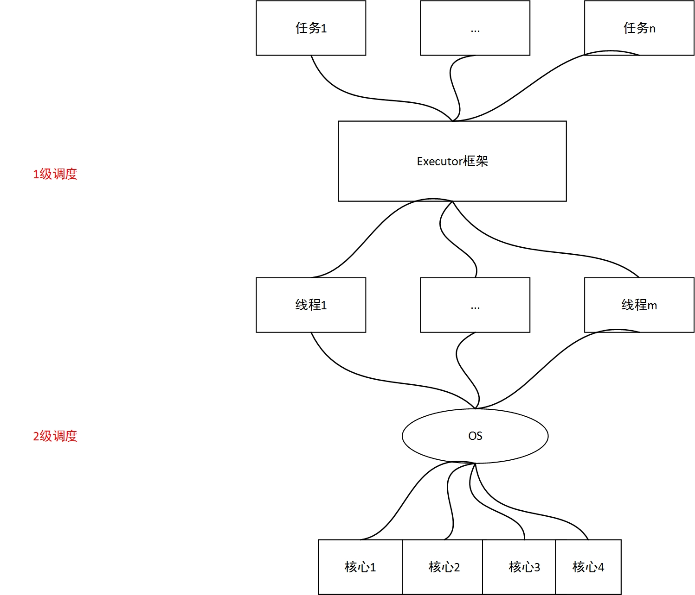

**Executor框架**
---
### 1 为什么要用Executor框架？
java多线程，使得我们可以把一个大任务划分成若干个子任务，然后将每个子任务映射到一个线程上，用于来执行任务；因此，在多核心CPU条件下，并发执行子任务成为可能，这大大提高了任务处理速度。

多线程可以带来上述好处，但是也不可避免地引入了一些问题，我们不得不在线程的声明周期内，多花精力来关注线程，如创建线程，销毁线程等等，这不仅大大分散了程序猿的精力，过多关注非业务逻辑，而且创建、销毁线程耗费大量资源，有时候可能还会影响程序整体性能。

为了解决这些问题，人们提出了Executor框架，基于该框架，我们可以定义若干个子任务，然后将这些子任务提交给Executor框架，Executor框架负责管理线程，并且为每一个任务分配能够执行的线程。
Executor框架采用两级调度架构，如图所示：

如上图所示，一级调度由Executor框架完成，二级调度由操作系统来完成，我们可以控制的是一级调度。

### 2 Executor框架的好处

Executor框架提出后，程序猿可以更加关注于业务逻辑，而不是费时费力地去控制线程，这些事情交给Executor框架，让它来帮助我们做一些繁琐且重复率极高的事情。

另外，线程的创建和销毁过于耗费资源，Executor借助于线程池，实现了线程的复用，大大提高了资源利用率。

实际上，在实际的开发过程中，程序猿往往不会自己去创建线程，只需要定义好任务体，然后通过Executor框架来完成任务的执行，必要的时候通过Future和Callable接口获取线程的执行结果。

在项目开发中，根据需求的不同，大致设计不同类型的线程，如：  

- 周期性的执行任务，可以通过Executor创建周期线程来执行任务；
- 对于资源紧张的场景，可以通过Executor框架限制创建线程的数量，并尽可能多地复用线程
- 通过Executor创建一次性线程
