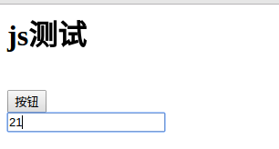
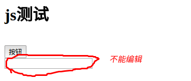

## AJAX
### 异步与同步
针对浏览器发请求到回应而言的
- 异步就是，发送完请求，去干别的事情了，不用在那里傻傻等待请求结果（很灵活）
- 同步就是，发送完请求之后，就在那里等着，什么时候拿到请求结果了，什么时候就不等了，然后再去干其他事情（认死理）

以前看ajax的时候说它的一个特点就是异步刷新（从名字也可以看出来），但是一直不甚理解，即使通过同步方式发送请求，我依然可以浏览本页面的网页（这也算是在干其他事情），但是今天重要搞懂了，通过ajax不仅仅可以在发送请求之后，浏览网页（在请求结果没有回来之前），还可以填写接下来的表格，再点击按钮，发送另外的请求，这些通过同步方式发送请求是干不了的。
以一段代码解释这个情况：
```
//客户端
<script type="text/javascript">
    $(document).ready(function () {
        $("#b").click(function () {
            alert("开始执行");
            $.ajax({
                url:"login",
                dataType:"json",
                async:true, //异步，false表示同步方式
                success:function (data) {
                    var data_str = JSON.stringify(data)        
                    alert(data_str)
                },
                error:function () {
                    alert("请求错误")
                }
            })
        });
    });

</script>

<body>
    <h1>js测试</h1><br>
    <input type="button" value="按钮" id="b" ><br>
    <input type="text" name="text" >
</body>

//服务端的代码
@ResponseBody
@RequestMapping("/login")
public String login() throws InterruptedException {
    System.out.println("进行ajax。。。");
    //用于模拟需要对请求数据进行很长时间处理
    Thread.sleep(1000*20);
    return "{\"name\":\"shenzhen\"}";
}
```
看看结果：
- 异步（发送请求之后，还可以对文本框进行编辑）：

- 同步


### 使用ajax的好处
1 可以实现异步刷新，就是上面所说的好处

2 可以实现局部刷新
什么意思呢？传统的请求响应方式是，当响应数据回来之后，浏览器根据响应数据加载整个页面，但是实际情况是，有时候的请求往往是针对页面中的某一个点而言的（如购物网站中获取库存量），这个时候再刷新整个页面是不是就不可取了，此时可以采用ajax技术实现局部刷新。
采用ajax进行局部刷新有主要有两点好处：
- 减轻浏览器的工作量
- 服务器传回来的响应数据很小（仅仅针对某个点，不是页面全部数据），此时可以带宽压力

### ajax的用法
基于jquery库进行的
```
$.ajax(
	url  //请求地址
    async  //是否异步
    dataType   //期望服务器返回的响应数据的格式
    success(函数对象)   //请求成功之后所执行的函数
    error(函数对象)  //请求失败之后所执行的函数对象
    ...
);
```