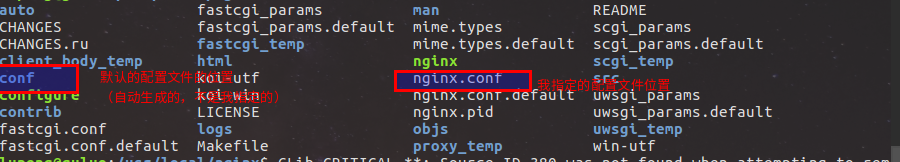

## nginx安装

1 官网下载安装包，nginx\_xxx_.tar.gz

2 解压，建议解压到/usr/local/目录下

3 安装nginx的依赖包(通常情况下，安装的时候，如果依赖包不存在会安装失败，并且会提示需要哪些依赖包，按照提示安装依赖包就行了)

4 进入/usr/local/nginx/目录（在这之前最好把解压目录改名为nginx）,执行
	`sudo ./configure --各个参数` --网上都有解释
    
重要的是：
\--sbin-path  执行文件所在目录(以后就是执行它来启动nginx)
\--conf-path  配置文件所在的目录（这里有坑）
\--pid-path  用于指定存放nginx主进程的pid的文件的位置

5 执行`sudo make & sudo make install`

6 启动nginx: ‘sudo /usr/local/nginx/nginx’，默认情况下会开启两个进程一个master进程和一个worker进程
_ _ _

**修改配置文件失效问题**

运行成功之后我遇到了一个大坑，我在执行./configure的时候已经指定了nginx配置文件的位置（默认是放在/usr/local/nginx/conf/目录下），但是在make之后，还是会生成一个默认的配置文件并且放在conf目录下；

如图所示，然后我傻傻的去修改conf目录下的配置文件，一直不起作用，害的我因为这个问题折腾了一下午，注意注意
*这里好奇怪呀，都已经指定配置文件地址了，不明白为什么还会自动生成一个？？？*