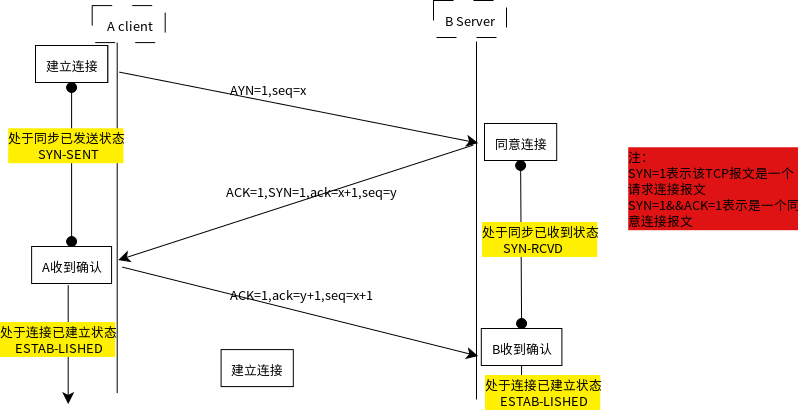
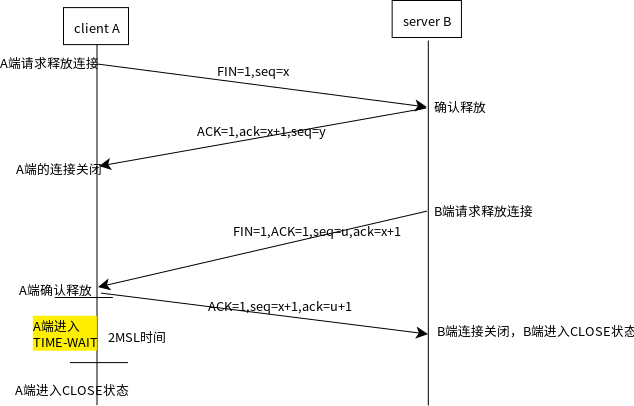

<!-- MarkdownTOC -->

- 1 rm
- 2 ps
- 3 netstat

<!-- /MarkdownTOC -->


### 1 rm
rm 命令用于删除一个文件（Linux中目录也是文件）
常用参数：

-f (force缩写) 强制删除文件
-i 在删除文件之前提示用于确认
-r 递归删除文件（删除一个目录的话，必须加参数-r）
-v 显示删除过程中的详细信息

**rm模糊删除**

删除9001开头的目录及子目录，（此方法可以实现批量删除）
```
:~$ ls
90011  90012  9003 
:~$ rm -r 9001*/
:~$ ls
9003
```

### 2 ps


### 3 netstat

netstat用于监控TCP/IP网络，可以查看端口好，连接信息等等

直接netstat 显示连接，不包括已经建立连接的
-a 显示所有连接，包括监听的
-l 仅仅显示处于监听状态的套接字
-n 以ip地址代替域名（netstat默认情况下是以域名加端口号显示套接字的）
-t 显示tcp连接
-u 显示udp连接
-c 试试监控（每一秒更新一次）
-p 显示建立这条连接的命令名称

**需要知道网络知识：**

*TCP连接 三次握手*



如图所示，在建立TCP连接的时候需要经过三次握手，首先客户端A发送请求连接报文，请求连接报文中的部分字段必须设置成如下形式：SYN=1，seq=x，其中SYN=1表示这是一个请求连接报文，seq=x表示的是序列号，x是随机生成的；此时A会处于同步已发送状态(SYN-SENT)

服务端B收到连接请求，若同意连接，那么会向A发送同意连接报文，同意连接报文中部分字段必须设置：SYN=1,ACK=1(两者合在一块表示这是一个同意连接报文)，ack=x+1(表示你发送的数据我已经收到了，下面需要你发送序号为x+1的数据),seq=y（y是随机生成的）,此时B会处于同步已收到状态(SYN-RCVD)

客户端收到同意连接报文之后，会在此向B发送一个确认报文，该报文中的部分字段必须是：ACK=1，ack=y+1,seq=x+1(这个就不是随机生成的了)

*TCP连接为什么是三次，不是两次或者是四次或者更多次？*

TCP为了保证数据的可靠性，采用超时重传机制，即在发送完数据之后，规定时间内没有收到确认的话，就认为该数据没有发送成功，会再次发送。

- 在建立TCP连接的时候，如果是一次握手的话，显而易见不能保证连接一定建立；
- 两次握手也不行，如果B收到连接报文之后，发送同意连接报文并建立一个连接（开启一个线程负责该连接），但是不能保证A一定可以收到同意连接报文，如果A没有收到的话，会超时重传请求连接消息，于是B又发送同意连接报文并建立连接（又开启一个线程负责连接）...如此，但是实际上知识同一个用户的一次连接而已，这样会造成服务器资源的大量浪费，甚至崩掉（太多的连接，但是很多都是无用的） 
- 四次或者多次 A收到确认报文后，此时可以确定的是，B能够收到我的请求报文，并且愿意与我连接（此时理论上A就可以发送真正数据了）；B收到确认后，可以确定A已经知道我同意它连接了，我现在可以为他提供服务了，因此经过三次握手之后彼此之间都已经知道对方的情况了，再进行握手的话虽然更加可靠，但是并不能提高太多（三次已经完全足够了），因此我造成资源上面的浪费，弊大于利

**TCP释放连接**

释放TCP连接要经过四次挥手，如图所示：



如图所示，释放TCP连接的时候，要释放端A首先发送释放TCP报文给B，请求释放报文部分字段：FIN=1(表示这是一个请求释放报文),seq=x

B收到请求释放报文之后，若同意，那么发送确认报文给A，确认报文部分字段为ACK=1(表示你的请求我收到了，我同意你释放TCP),ack=x+1,seq=y

当A收到确认报文之后，A处于FIN-WAIT状态，此时意味着A不能再发送有效数据（就是表示确认报文的那种数据）给B了，但是仍然可以接收B发送过来的消息

过一会B也没有要发送的数据了，那么B也要释放TCP连接，会发送释放TCP连接请求给A，报文部分字段为FIN=1，ACk=1，seq=u,ack=x+1(注意)

A收到B发过来的释放TCP连接请求之后，会确认，并给B发送确认报文，报文部分字段为ACK=1，seq=x+1,ack=u+1,之后A进入TIME-WAIT，经过2个MSL时间之后，如果没有再次收到B发过来的报文那么就关闭A端的TCP连接（此时才算真正关闭连接）

B收到A的确认报文之后，B端的TCP连接关闭

*为什么A要经过2个MSL时间之后再关闭A端的TCP连接呢？*

因为A端发生的确认释放报文有可能在发送给B的过程中丢失，那么B在一定时间内没有收到确认报文，就会重发，因此如果A发送完确认释放报文之后立刻关闭，可能会导致B无法关闭；

MSL是报文最大生存时间，在A发送确认报文之后，经过2个MSL时间，可以确保A与B之间的TCP连接上没有报文了，此时可以安心关闭了。

**netstat 示例**

```
//查看本机基于TCP协议的连接情况，并以{ip:port}显示套接字
:~$ netstat -atn
激活Internet连接 (服务器和已建立连接的)
Proto Recv-Q Send-Q Local Address           Foreign Address         State      
tcp        0      0 127.0.1.1:53            0.0.0.0:*               LISTEN     
tcp        0      0 0.0.0.0:22              0.0.0.0:*               LISTEN     
tcp        0      0 127.0.0.1:631           0.0.0.0:*               LISTEN     
tcp        0      0 127.0.0.1:51004         0.0.0.0:*               LISTEN     
tcp        0      0 127.0.0.1:6942          0.0.0.0:*               LISTEN     
tcp        0      0 127.0.0.1:33857         0.0.0.0:*               LISTEN     
tcp        0      0 0.0.0.0:35652           0.0.0.0:*               LISTEN     
tcp        0      0 127.0.0.1:3306          0.0.0.0:*               LISTEN     
tcp        0      0 127.0.0.1:63342         0.0.0.0:*               LISTEN     
tcp        0      1 192.168.0.183:54882     74.125.204.138:443      SYN_SENT   
tcp        0      0 127.0.0.1:39024         127.0.0.1:33857         ESTABLISHED
tcp        0      0 127.0.0.1:33857         127.0.0.1:39024         ESTABLISHED
tcp        0      0 127.0.0.1:42136         127.0.0.1:51004         ESTABLISHED
tcp        0      0 127.0.0.1:51004         127.0.0.1:42136         ESTABLISHED
tcp        4      0 192.168.0.183:46506     192.168.0.161:139       ESTABLISHED
tcp        0      1 192.168.0.183:53318     74.125.204.100:443      SYN_SENT   
tcp        0      0 192.168.0.183:53166     58.87.82.241:443        ESTABLISHED
tcp        0      1 192.168.0.183:45678     64.233.189.101:443      SYN_SENT   
tcp        0      1 192.168.0.183:45680     64.233.189.101:443      SYN_SENT   
tcp        0      0 192.168.0.183:55254     108.177.97.188:5228     ESTABLISHED
tcp        4      0 192.168.0.183:46504     192.168.0.161:139       ESTABLISHED

//查看mysql的连接情况（mysql的连接是基于TCP的）,mysql服务处于监听状态，监听本机3306端口
:~$ netstat -tan | grep 3306
tcp        0      0 127.0.0.1:3306          0.0.0.0:*               LISTEN 

//有用户连接msql，可以发现mysql会开启一个服务负责与127.0.0.1:53014建立连接，因为我是在同一台机器上测试的，所以显示了两条TCP连接
tcp        0      0 127.0.0.1:3306          0.0.0.0:*               LISTEN     
tcp        0      0 127.0.0.1:53014         127.0.0.1:3306          ESTABLISHED
tcp        0      0 127.0.0.1:3306          127.0.0.1:53014         ESTABLISHED

//断开mysql连接，会处于TIME-WAIT状态一段时间之后，该连接才消失
tcp        0      0 127.0.0.1:3306          0.0.0.0:*               LISTEN     
tcp        0      0 127.0.0.1:53014         127.0.0.1:3306          TIME_WAIT  //注意
```

*注意从最后一个示例也可以看出来，mysql服务器在收到确认释放TCP连接之后就立刻关闭了，而客户端mysql会处于TIME-WAIT一段时间之后才真正关闭这条连接*

*另外在使用netstat查看端口好的时候，最好加上-n参数，因为如果不加的话，是以域名方式显示的，这个时候它的端口号可能也是一个名字而不是一个具体的数据，如我向查看mysq服务状态*
```
//查看mysql服务状态，根本查不到任何信息
:~$ netstat -at | grep 3306

//以域名形式显示
:~$ netstat -at
...
tcp        0      0 localhost:mysql         *:*                     LISTEN 
...

//以{ip:port}形式显示，加-n参数
:~$ netstat -atn | grep 3306
tcp        0      0 127.0.0.1:3306          0.0.0.0:*               LISTEN
```
