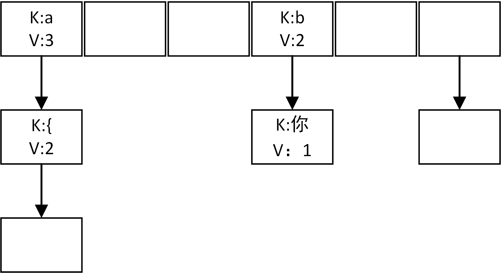

算法很是欠缺，以后，时不时看看算法

## 字符串中第一个出现一次的字符
如字符串`String str = "aa中a中你bbc{hj{jc"`,可以看出，该字符串中第一个仅仅出现一次的字符是“你”，应该如何查找？

首先想到的是：以字符串中每一个字符为基准，遍历之后的字符，当发现有字符仅仅出现一次，那么这个字符就是我们需要找的字符，但是这样时间复杂度是O(n2),并不可取。

有效的方法：借助于一个hash表，把字符串中的每一个字符，根据其hash值，在设计一种hash算法将其散列到hash表的对应节点上（节点上存储的时一个key-value对，key就是对应字符，value就是字符出现的次数），如果该节点上正好有相同的key的话，value+1，如果key不相同，采用链地址发，解决冲突。



构建完hash表之后，在遍历一遍字符串，根据hash值，从hash表中找第一个value=1的字符，就是我们需要找的字符串。

这种算法思想非常好，因为，如果hash算法设计的足够好的话，就没有冲突，均散列到hash表的数组上，那么在查找的时候，就可以不用遍历冲突链表，直接找到对应节点，那么该字符出现的次数也就确定了。

理想状况下，这种算法的时间复杂度是O(n).

Java代码实现：
```
/**
*设计节点，存储key-value。由于在冲突的时候要构建链表，所以加了一个指针next
**/
class Node{
    private char key;
    private int value;
    private Node next;

    public Node(){}

    public Node(char key,int value,Node next){
        this.key = key;
        this.value = value;
        this.next = next;
    }

    public char getKey() {
        return key;
    }

    public void setKey(char key) {
        this.key = key;
    }

    public int getValue() {
        return value;
    }

    public void setValue(int value) {
        this.value = value;
    }

    public void setNext(Node next) {
        this.next = next;
    }

    public Node getNext() {
        return next;
    }
}

/**
*具体方法
**/
public class CharAppearanceOnceString {
    public static void main(String[] args) {
    	//要测试的字符串
        String str = "aa中a中国bbc{hj{jc";
        //hash表的主体：数组
        Node[] array = new Node[512];
        for (Character c : str.toCharArray()){
        	//采用取余算法，将元素散列到hash表中
            int index = c.hashCode() % 512;
            if(array[index] == null){
                array[index] = new Node(c,1,null);
            }else {
                if (array[index].getKey() == c){
                    array[index].setValue(array[index].getValue() + 1);
                }else {
                	//如果存在冲突，那么采用链地址法解决冲突
                    Node e = array[index];
                    boolean flag = false;
                    while (e.getNext() != null){
                        e = e.getNext();
                        if (e.getKey() == c){
                            e.setValue(e.getValue() + 1);
                            flag = true;
                            break;
                        }
                    }
                    if (!flag){
                        Node node = new Node(c,1,null);
                        e.setNext(node);
                        flag = false;
                    }
                }
            }
        }

        int count = 0;

        //遍历字符串，找到第一个value=1的字符
        for (Character c : str.toCharArray()){
            int hash = c.hashCode() % 512;
            if (array[hash].getKey() == c){
                count = array[hash].getValue();
                if (count == 1){
                    System.out.println(array[hash].getKey());
                    return;
                }
            }else {
                Node e = array[hash];
                while (e != null){
                    if (e.getKey() == c){
                        count = e.getValue();
                        if (count == 1){
                            System.out.println(array[hash].getKey());
                            return;
                        }
                    }
                    e = e.getNext();
                }
            }
        }
    }
}
```